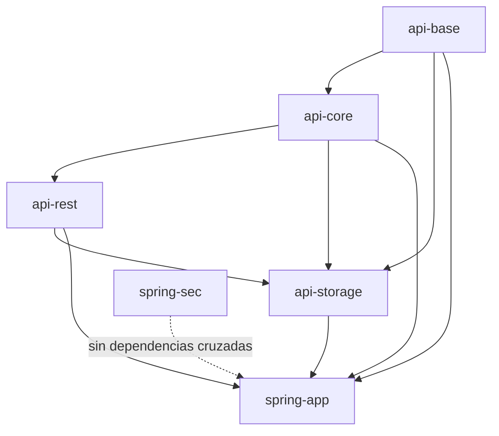
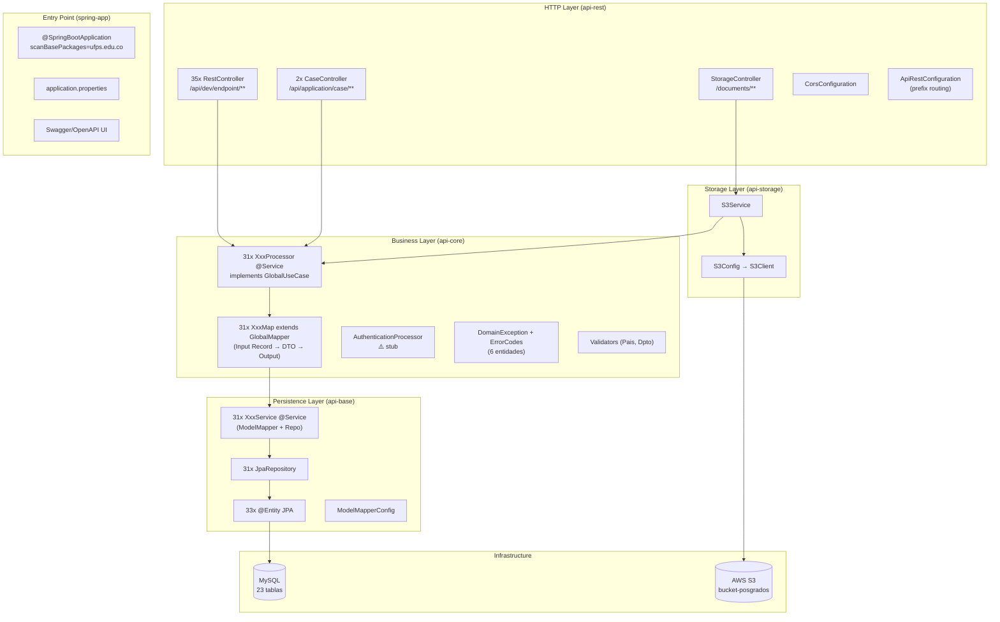

# Arquitectura: Proyecto Posgrados Backend

> **Stack**: Spring Boot 4.0.6 · Java 21 · Maven Multi-módulo · MySQL · AWS S3  
> **Institución**: UFPS (Universidad Francisco de Paula Santander)  
> **Generación de código**: Telosys 4.3.0 (ORM/scaffolding)

---

## 1. Visión General

El proyecto es una **REST API monolítica modularizada** desarrollada como un proyecto Maven multi-módulo. No es un sistema de microservicios — todos los módulos compilan y despliegan juntos como un único artefacto Spring Boot. La modularización es **lógica/arquitectónica**, no de despliegue.

El dominio es la **gestión de posgrados académicos**: aspirantes, programas, cohortes, ofertas académicas, entrevistas y documentos respaldados en AWS S3.

---

## 2. Estructura de Módulos y Cadena de Dependencias

```
posgrados (pom root)
├── api-base          ← Capa de persistencia (JPA/MySQL)
├── api-core          ← Capa de dominio y lógica de negocio
├── api-rest          ← Capa HTTP / controladores REST
├── api-storage       ← Integración AWS S3 + endpoints de documentos
├── spring-app        ← Entry point (@SpringBootApplication) + configuración central
└── spring-sec        ← Módulo de seguridad (stub/incompleto)
```

### Cadena de dependencias (Maven)



> `spring-app` es el único módulo con `spring-boot-maven-plugin` activo → genera el JAR ejecutable.

---

## 3. Arquitectura por Capas (Flujo de Request)

```
HTTP Request
     │
     ▼
[api-rest] RestController
     │  (invoca directamente)
     ▼
[api-core] Processor (@Service)
     │  map.toDto(input)
     ▼
[api-core] XxxMap (GlobalMapper)
     │  convierte Input Record → DTO
     ▼
[api-base/rest] XxxService (@Service)
     │  usa JpaRepository
     ▼
[api-base] XxxRepository (JpaRepository<Entity, ID>)
     │
     ▼
MySQL Database
```

### Descripción de cada capa

| Capa | Módulo | Responsabilidad |
|---|---|---|
| **Controller** | `api-rest` | Recibir HTTP, delegar al Processor, retornar `ResponseEntity` |
| **Processor** | `api-core` | Orquestar la lógica: map → service → map de vuelta |
| **Map (GlobalMapper)** | `api-core` | Transformar `InputRequest` → `DTO`, `DTO` → `OutputResponse` |
| **Service** | `api-base` (paquete `rest.services`) | CRUD sobre repositorio JPA, encapsula [ModelMapper](file:///d:/postgrados/Proyecto_Posgrados_backend/api-base/src/main/java/ufps/edu/co/config/ModelMapperConfig.java#7-15) |
| **Repository** | `api-base` | Interfaz `JpaRepository` de Spring Data |
| **Entity** | `api-base` | `@Entity` JPA, mapeadas a tablas MySQL |

---

## 4. Módulos en Profundidad

### 4.1 `api-base` — Persistencia
**Dependencias**: `spring-data-jpa`, `mysql-connector-j`, `modelmapper`  

Contiene:
- **33 entidades JPA** (generadas con Telosys), todas en `ufps.edu.co.persistence.entities`
- **33 repositorios** `JpaRepository<Entity, Integer>` en `ufps.edu.co.persistence.repositories`
- **33 Services** en `ufps.edu.co.rest.services` que encapsulan operaciones CRUD básicas usando ModelMapper para Entity↔DTO
- **Configuración**: [ModelMapperConfig](file:///d:/postgrados/Proyecto_Posgrados_backend/api-base/src/main/java/ufps/edu/co/config/ModelMapperConfig.java#7-15) (bean [ModelMapper](file:///d:/postgrados/Proyecto_Posgrados_backend/api-base/src/main/java/ufps/edu/co/config/ModelMapperConfig.java#7-15) con configuración default)

Las entidades usan el patrón Telosys: `@Getter @Setter @NoArgsConstructor @AllArgsConstructor @Builder`, relaciones con `insertable=false, updatable=false` en el lado FK (patrón dual-column).

### 4.2 `api-core` — Dominio y Lógica de Negocio
**Dependencias**: `spring-context`, `spring-boot-starter-validation`, `spring-tx`, `api-base`, `modelmapper`

Contiene:
- **`GlobalMapper<C,U,D,P,F,O,DTO>`** — clase abstracta de tipo-dispatch. Un [toDto(InputRequest)](file:///d:/postgrados/Proyecto_Posgrados_backend/api-core/src/main/java/ufps/edu/co/maps/GlobalMapper.java#28-51) central hace `instanceof` en runtime y delega al método correcto ([toDtoCreate](file:///d:/postgrados/Proyecto_Posgrados_backend/api-core/src/main/java/ufps/edu/co/maps/GlobalMapper.java#52-56), [toDtoUpdate](file:///d:/postgrados/Proyecto_Posgrados_backend/api-core/src/main/java/ufps/edu/co/maps/GlobalMapper.java#57-58), etc.)
- **31 mappers concretos** (`XxxMap extends GlobalMapper`) en `maps/specific/`
- **`CrudProcessor<C,U,D,P,F,O>`** — interfaz genérica de contrato CRUD: [create](file:///d:/postgrados/Proyecto_Posgrados_backend/api-core/src/main/java/ufps/edu/co/processor/crud/SedeProcessor.java#27-36), [update](file:///d:/postgrados/Proyecto_Posgrados_backend/api-core/src/main/java/ufps/edu/co/processor/abstracts/contract/CrudProcessor.java#11-12), [delete](file:///d:/postgrados/Proyecto_Posgrados_backend/api-core/src/main/java/ufps/edu/co/processor/abstracts/contract/CrudProcessor.java#13-14), [patch](file:///d:/postgrados/Proyecto_Posgrados_backend/api-core/src/main/java/ufps/edu/co/processor/abstracts/contract/CrudProcessor.java#15-16), [findById](file:///d:/postgrados/Proyecto_Posgrados_backend/api-core/src/main/java/ufps/edu/co/processor/abstracts/contract/CrudProcessor.java#17-18), [findAll](file:///d:/postgrados/Proyecto_Posgrados_backend/api-core/src/main/java/ufps/edu/co/processor/crud/DocumentoProcessor.java#66-74)
- **`GlobalUseCase`** — segunda interfaz (extiende o redefine CrudProcessor con [deleteById](file:///d:/postgrados/Proyecto_Posgrados_backend/api-core/src/main/java/ufps/edu/co/processor/crud/SedeProcessor.java#80-88))
- **31 processors CRUD** (`@Service`) en `processor/crud/`
- **[LoginProcessor](file:///d:/postgrados/Proyecto_Posgrados_backend/api-core/src/main/java/ufps/edu/co/processor/abstracts/contract/LoginProcessor.java#8-12)** — interfaz con [authenticate(LoginInput)](file:///d:/postgrados/Proyecto_Posgrados_backend/api-core/src/main/java/ufps/edu/co/processor/cases/AuthenticationProcessor.java#11-16) y [refreshToken(String)](file:///d:/postgrados/Proyecto_Posgrados_backend/api-core/src/main/java/ufps/edu/co/processor/cases/AuthenticationProcessor.java#17-22)
- **[AuthenticationProcessor](file:///d:/postgrados/Proyecto_Posgrados_backend/api-core/src/main/java/ufps/edu/co/processor/cases/AuthenticationProcessor.java#9-24)** — implementa [LoginProcessor](file:///d:/postgrados/Proyecto_Posgrados_backend/api-core/src/main/java/ufps/edu/co/processor/abstracts/contract/LoginProcessor.java#8-12) pero **todos los métodos lanzan `UnsupportedOperationException`** (stub)
- **6 [ErrorCode](file:///d:/postgrados/Proyecto_Posgrados_backend/api-core/src/main/java/ufps/edu/co/domain/exceptions/BaseErrorCode.java#3-9) enums** solo para: `Cohorte`, `Departamento`, `Genero`, `Otrosvalores`, [Pais](file:///d:/postgrados/Proyecto_Posgrados_backend/api-core/src/main/java/ufps/edu/co/domain/validators/PaisValidator.java#3-26), [Sede](file:///d:/postgrados/Proyecto_Posgrados_backend/api-core/src/main/java/ufps/edu/co/maps/specific/SedeMap.java#10-61) (cobertura parcial)
- **2 validadores de dominio**: [PaisValidator](file:///d:/postgrados/Proyecto_Posgrados_backend/api-core/src/main/java/ufps/edu/co/domain/validators/PaisValidator.java#3-26), `DepartamentoValidator` (utilidades estáticas)
- **[DomainException](file:///d:/postgrados/Proyecto_Posgrados_backend/api-core/src/main/java/ufps/edu/co/domain/exceptions/DomainException.java#5-25)** — `RuntimeException` con [BaseErrorCode](file:///d:/postgrados/Proyecto_Posgrados_backend/api-core/src/main/java/ufps/edu/co/domain/exceptions/BaseErrorCode.java#3-9) y parámetro contextual

### 4.3 `api-rest` — Controladores HTTP
**Dependencias**: `api-core`, `spring-boot-starter-webmvc`, `modelmapper`

Contiene:
- **35 controladores REST** (`@RestController`) en `controllers/rest/` — uno por entidad
- **2 controladores de casos de uso** en `controllers/cases/` (operaciones compuestas)
  - [SedeRestCase](file:///d:/postgrados/Proyecto_Posgrados_backend/api-rest/src/main/java/ufps/edu/co/controllers/cases/SedeRestCase.java#17-30): `POST /sede/createWithUbicacion` (crea sede + ubicación en un solo request)
  - `DirectorfacultadCase`: operación específica de director de facultad
- **[ApiRestConfiguration](file:///d:/postgrados/Proyecto_Posgrados_backend/api-rest/src/main/java/ufps/edu/co/config/path/ApiRestConfiguration.java#17-37)**: prefijos globales de URL configurables:
  - `/posgrados-project/api/dev/endpoint/**` → controladores `controllers.rest`
  - `/posgrados-project/api/application/case/**` → controladores `controllers.cases`
- **[CorsConfiguration](file:///d:/postgrados/Proyecto_Posgrados_backend/api-rest/src/main/java/ufps/edu/co/config/security/CorsConfiguration.java#7-21)**: abierto totalmente (`allowedOrigins("*")`, todos los métodos)

### 4.4 `api-storage` — Almacenamiento AWS S3
**Dependencias**: `aws-sdk-s3 2.25.0`, `aws-sdk-auth 2.25.0`, `api-base`, `api-core`, `api-rest`

> ⚠️ **Inconsistencia crítica**: `api-storage` depende de `api-rest`. Un módulo de infraestructura (storage) depende de la capa HTTP (REST). Esto **invierte** la dirección de dependencias esperada.

Contiene:
- **[S3Config](file:///d:/postgrados/Proyecto_Posgrados_backend/api-storage/src/main/java/ufps/edu/co/config/S3Config.java#12-32)**: crea `S3Client` con credenciales de `AWS_ACCESS_KEY`, `AWS_SECRET_KEY`, `AWS_REGION`
- **[S3Service](file:///d:/postgrados/Proyecto_Posgrados_backend/api-storage/src/main/java/ufps/edu/co/services/S3Service.java#20-59)**: servicio que:
  - [downloadDocument(DOCUMENTO_FIND)](file:///d:/postgrados/Proyecto_Posgrados_backend/api-storage/src/main/java/ufps/edu/co/services/S3Service.java#32-42) → busca el `keyfile` en BD vía [DocumentoProcessor](file:///d:/postgrados/Proyecto_Posgrados_backend/api-core/src/main/java/ufps/edu/co/processor/crud/DocumentoProcessor.java#16-122) y descarga bytes de S3
  - [approveDocument(DOCUMENTO_FIND)](file:///d:/postgrados/Proyecto_Posgrados_backend/api-storage/src/main/java/ufps/edu/co/services/S3Service.java#43-46) → delega a `DocumentoProcessor.approveDocument()`
  - [rejectDocument(DOCUMENTO_REJECT)](file:///d:/postgrados/Proyecto_Posgrados_backend/api-storage/src/main/java/ufps/edu/co/controllers/StorageController.java#57-66) → delega a `DocumentoProcessor.rejectDocument()`
  - [findDocumentByAspirantId(ASPIRANTE_FIND)](file:///d:/postgrados/Proyecto_Posgrados_backend/api-storage/src/main/java/ufps/edu/co/controllers/StorageController.java#67-76) → delega a `DocumentoProcessor.findByAspiranteId()`
- **[StorageController](file:///d:/postgrados/Proyecto_Posgrados_backend/api-storage/src/main/java/ufps/edu/co/controllers/StorageController.java#21-78)**: expone 4 endpoints en `/documents/` (fuera del prefijo `/posgrados-project/api/dev/endpoint`)

### 4.5 `spring-app` — Entry Point
**Dependencias**: todos los módulos + `springdoc-openapi-starter-webmvc-ui 3.0.2`

- [Application.java](file:///d:/postgrados/Proyecto_Posgrados_backend/spring-app/src/main/java/ufps/edu/co/Application.java): `@SpringBootApplication(scanBasePackages = "ufps.edu.co")` — activa el scan de todo el paquete raíz
- [application.properties](file:///d:/postgrados/Proyecto_Posgrados_backend/spring-app/src/main/resources/application.properties): carga variables de [.env.properties](file:///d:/postgrados/Proyecto_Posgrados_backend/.env.properties), configura datasource, JPA, Swagger/OpenAPI
- `ddl-auto=none` — no se modifica el esquema automáticamente; el DDL está en [.sql/.ddl.sql](file:///d:/postgrados/Proyecto_Posgrados_backend/.sql/.ddl.sql)

### 4.6 `spring-sec` — Seguridad (Stub)
Solo contiene [SpringSecurityModuleStartupCheck.java](file:///d:/postgrados/Proyecto_Posgrados_backend/spring-sec/src/main/java/ufps/edu/co/config/build/SpringSecurityModuleStartupCheck.java). **No tiene** `spring-security` como dependencia, solo `spring-boot-starter-webmvc`. Es un módulo placeholder para implementación futura.

---

## 5. Modelo de Base de Datos (MySQL)

28 tablas organizadas en grupos temáticos:

### Geografía y Referencial
```
pais → departamento → municipio → ubicacion
genero · estado · otrosvalores
```

### Organización Académica
```
sede → programa → ofertaacademica
       ↑           ↑       ↑        ↑      ↑
    facultad    modalidad jornada cohorte plazo←tipoplazo
       ↑
   administrativo → cargo
       ↑
     persona ← ubicacion, genero
```

### Usuarios y Acceso
```
persona → usuario (rol, clave)
persona → aspirante
persona → administrativo
```

### Documentos
```
aspirante → documento → tipodocumento
                      → estadodocumento
                      → plazo
                      → administrativo (revisor)
documento ←→ cambiodocumento (historial)
```

### Entrevistas
```
aspirante → entrevista → tipoentrevista
                       → entrevistador (administrativo)
                       → estado
aspirante · administrativo → entrevistadores (tabla intermedia m:n)
```

> **Nota crítica**: `ofertaacademica` referencia `cohorte` pero en el DDL la tabla `cohorte` aparece **después** que `ofertaacademica` en el `CREATE TABLE`. Esto genera error de FK en MySQL con `FOREIGN_KEY_CHECKS=0` al momento de creación si el orden no es respetado, aunque el script lo maneja con `SET FOREIGN_KEY_CHECKS=0`.

> **Nota**: Las contraseñas (`clave.valor`) se guardan en texto plano sin cifrado en la tabla `clave`. Sin Spring Security activo, no hay hash.

---

## 6. Patrón de Comunicación entre Componentes

### 6.1 Input Records (Java Records como DTOs de entrada)
Cada entidad tiene un archivo `XxxInput` con inner records por operación:
```java
// Ejemplo conceptual
public class SedeInput {
    public record SEDE_CREATE(String nombre, int idUbicacion) implements CreateType {}
    public record SEDE_UPDATE(int id, String nombre, int idUbicacion) implements UpdateType {}
    public record SEDE_DELETE(int id) implements DeleteType {}
    public record SEDE_PATCH(int id, String nombre, int idUbicacion) implements PatchType {}
    public record SEDE_FIND(int id) implements FindType {}
    public record SEDE_CREATE_WITH_UBICACION(String nombre, String ubicacion) {}
}
```

### 6.2 Output Records
`XxxOutput` son records inmutables que el controller retorna como JSON.

### 6.3 DTOs Intermedios (XxxDTO)
`XxxDTO` son POJOs mutables con `@Getter @Setter` que circulan entre Service y Processor. Están en `api-base` en el paquete `rest.dto`.

### 6.4 Flujo completo ejemplo: `POST /posgrados-project/api/dev/endpoint/sedes/create`
```
1. SedeController.create(@RequestBody SEDE_CREATE request)
2. → SedeProcessor.create(request)
3.   → SedeMap.toDto(request) → toDtoCreate(SEDE_CREATE) → SedeDTO
4.   → SedeService.create(SedeDTO) → ModelMapper.map(dto, SedeEntity)
5.   → SedeRepository.save(entity) → MySQL INSERT
6.   → ModelMapper.map(savedEntity, SedeDTO) → retorna SedeDTO
7.   ← SedeMap.toOutput(SedeDTO) → ⚠️ LANZA UnsupportedOperationException
```

> **Bug crítico**: `SedeMap.toOutput()` lanza `UnsupportedOperationException`. Esto significa que toda operación de [SedeProcessor](file:///d:/postgrados/Proyecto_Posgrados_backend/api-core/src/main/java/ufps/edu/co/processor/crud/SedeProcessor.java#17-94) que retorna `SedeOutput` fallará en runtime.

---

## 7. Sistema de Excepciones

```
BaseErrorCode (interface)
    ├── getCode(): String
    └── getDefaultMessage(): String
         ↑
  [XxxErrorCode implements BaseErrorCode]  (enum)
         ↑
  DomainException(RuntimeException)
      ├── BaseErrorCode code
      └── Object param
```

**Solo 6 entidades tienen [ErrorCode](file:///d:/postgrados/Proyecto_Posgrados_backend/api-core/src/main/java/ufps/edu/co/domain/exceptions/BaseErrorCode.java#3-9)**: Cohorte, Departamento, Genero, Otrosvalores, Pais, Sede.  
**Las demás 25+ entidades** (Aspirante, Documento, Entrevista, etc.) usan `RuntimeException` genérico directamente en los processors — **sin estructura de error tipada**.

No hay Global Exception Handler (`@ControllerAdvice`/`@RestControllerAdvice`). Las excepciones de dominio no se interceptan ni se traducen a respuestas HTTP estándar con body JSON de error.

---

## 8. Configuración y Entorno

### Variables de entorno ([.env.properties](file:///d:/postgrados/Proyecto_Posgrados_backend/.env.properties))
| Variable | Propósito |
|---|---|
| `DB_URL`, `DB_USER`, `DB_PASSWORD`, `DB_SCHEMA`, `DB_DRIVER`, `DB_DIALECT` | Conexión MySQL |
| `SPRING_SECURITY_USER`, `SPRING_SECURITY_PASSWORD` | Spring Security básico (httpBasic) |
| `APP_NAME`, `APP_PREFIX` | Nombre y contexto global (`/posgrados-project`) |
| `SWAGGER_API_DOCS_PATH`, `SWAGGER_UI_PATH`, `ENABLE_SWAGGER_UI`, `ENABLE_API_DOCS` | OpenAPI/Swagger |
| `AWS_ACCESS_KEY`, `AWS_SECRET_KEY`, `AWS_REGION`, `AWS_BUCKET_NAME` | AWS S3 |

> ⚠️ **Seguridad**: Las credenciales AWS reales están hardcodeadas en [.env.properties](file:///d:/postgrados/Proyecto_Posgrados_backend/.env.properties) y el archivo está (presumiblemente) en el repositorio Git. Esto es un riesgo de seguridad grave.

### Ambientes soportados
- **Local**: MySQL en `localhost:3306/posgrados` (activo por defecto)
- **Railway** (PaaS): configuración comentada en [.env.properties](file:///d:/postgrados/Proyecto_Posgrados_backend/.env.properties)

---

## 9. Patrones y Decisiones de Diseño

### Positivos ✅
- **Inversión de dependencias via interfaces**: [CrudProcessor](file:///d:/postgrados/Proyecto_Posgrados_backend/api-core/src/main/java/ufps/edu/co/processor/abstracts/contract/CrudProcessor.java#8-21), [LoginProcessor](file:///d:/postgrados/Proyecto_Posgrados_backend/api-core/src/main/java/ufps/edu/co/processor/abstracts/contract/LoginProcessor.java#8-12), [BaseErrorCode](file:///d:/postgrados/Proyecto_Posgrados_backend/api-core/src/main/java/ufps/edu/co/domain/exceptions/BaseErrorCode.java#3-9) son interfaces bien definidas
- **Tipo-parametrización genérica**: `CrudProcessor<C,U,D,P,F,O>` y `GlobalMapper<C,U,D,P,F,O,DTO>` reducen código repetitivo
- **Java Records para inputs**: inmutables, concisos, auto-`equals`/`hashCode`
- **Prefijos de URL configurables** vía [application.properties](file:///d:/postgrados/Proyecto_Posgrados_backend/spring-app/src/main/resources/application.properties) + [ApiRestConfiguration](file:///d:/postgrados/Proyecto_Posgrados_backend/api-rest/src/main/java/ufps/edu/co/config/path/ApiRestConfiguration.java#17-37)
- **Separación clara de capas** en módulos Maven separados
- **`ddl-auto=none`**: el esquema no se auto-modifica en producción

### Problemáticos ⚠️
- **Telosys generó código scaffolded**: los comentarios `// TODO Auto-generated method stub` y `throw new UnsupportedOperationException` abundan en mappers y processors
- **`GlobalMapper.toOutput()` no implementado en varios mappers** (e.g. `SedeMap.toOutput()`) → crash en runtime
- **[AuthenticationProcessor](file:///d:/postgrados/Proyecto_Posgrados_backend/api-core/src/main/java/ufps/edu/co/processor/cases/AuthenticationProcessor.java#9-24) stub completo**: la autenticación no funciona
- **`spring-sec` sin Spring Security**: el módulo no tiene la dependencia de seguridad real
- **`api-storage` depende de `api-rest`**: viola la dirección de capas (infraestructura → HTTP)
- **`UbicacionProcessor` instanciado con `new`** en `SedeProcessor.createWithUbicacion()`: bypasea el IoC container de Spring, los `@Autowired` del processor hijo no se inyectan
- **Filtro in-memory para [findByAspiranteId](file:///d:/postgrados/Proyecto_Posgrados_backend/api-core/src/main/java/ufps/edu/co/processor/crud/DocumentoProcessor.java#111-121)** en [DocumentoProcessor](file:///d:/postgrados/Proyecto_Posgrados_backend/api-core/src/main/java/ufps/edu/co/processor/crud/DocumentoProcessor.java#16-122): carga TODOS los documentos en memoria y filtra en Java — no hay consulta con `WHERE` en JPA
- **[ErrorCode](file:///d:/postgrados/Proyecto_Posgrados_backend/api-core/src/main/java/ufps/edu/co/domain/exceptions/BaseErrorCode.java#3-9) parcial**: solo 6 de 31 entidades tienen error codes tipados
- **Sin global exception handler**: errores se escapan como 500 sin body JSON útil
- **Credenciales AWS en [.env.properties](file:///d:/postgrados/Proyecto_Posgrados_backend/.env.properties)** potencialmente versionadas
- **CORS abierto** (`allowedOrigins("*")`) — aceptable en dev, riesgo en producción
- **Contraseñas en texto plano** en tabla `clave`
- **`spring.jpa.show-sql=true`** habilitado — podría exponerse en producción

---

## 10. Inventario de Entidades / Endpoints

### Entidades con CRUD completo (Procesador + Controller + Map + Service)
Aspirante, Administrativo, Cambiodocumento, Cargo, Clave, Cohorte, Departamento, Documento, Entrevista, Entrevistador, Entrevistadores, Estado, Estadodocumento, Facultad, Genero, Jornada, Modalidad, Municipio, Ofertaacademica, Otrosvalores, Pais, Persona, Plazo, Programa, Rol, Sede, Tipodocumento, Tipoentrevista, Tipoplazo, Ubicacion, Usuario

### Endpoints de almacenamiento (fuera del prefijo estándar)
| Método | Path | Función |
|---|---|---|
| POST | `/documents/list` | Descargar documento desde S3 |
| POST | `/documents/approve` | Aprobar documento (estado = 2) |
| POST | `/documents/reject` | Rechazar documento (estado = 3) |
| POST | `/documents/aspirantList` | Listar documentos por aspirante |

### Endpoint de caso de uso compuesto
| Método | Path | Función |
|---|---|---|
| POST | `/posgrados-project/api/application/case/sede/createWithUbicacion` | Crear sede + su ubicación |

---

## 11. Inconsistencias Críticas Resumidas

| # | Inconsistencia | Impacto |
|---|---|---|
| 1 | `SedeMap.toOutput()` lanza `UnsupportedOperationException` | Runtime crash en todas las ops de Sede |
| 2 | [AuthenticationProcessor](file:///d:/postgrados/Proyecto_Posgrados_backend/api-core/src/main/java/ufps/edu/co/processor/cases/AuthenticationProcessor.java#9-24) — todos los métodos sin implementar | Autenticación no funciona |
| 3 | `spring-sec` sin dependencias de Spring Security reales | Seguridad no existe |
| 4 | `new UbicacionProcessor()` (no Spring bean) en [SedeProcessor](file:///d:/postgrados/Proyecto_Posgrados_backend/api-core/src/main/java/ufps/edu/co/processor/crud/SedeProcessor.java#17-94) | NullPointerException en runtime por `@Autowired` no inyectados |
| 5 | [findByAspiranteId](file:///d:/postgrados/Proyecto_Posgrados_backend/api-core/src/main/java/ufps/edu/co/processor/crud/DocumentoProcessor.java#111-121) carga toda la tabla `documento` en memoria | O(N) sobre toda la BD |
| 6 | `api-storage` depende de `api-rest` | Inversión de capas (infraestructura → HTTP) |
| 7 | Solo 6 ErrorCodes tipados, 25+ entidades con `RuntimeException` genérico | Incoherencia en manejo de errores |
| 8 | Sin `@ControllerAdvice` global | 500s sin estructura en respuestas de error |
| 9 | `documento` aprueba/rechaza hardcodeando IDs 2 y 3 de `estadodocumento` | Acoplamiento a datos específicos de BD |
| 10 | DDL: `ofertaacademica` tiene FK a `cohorte` pero se crea antes que ella | Orden de creación incorrecto en DDL |
| 11 | Credenciales AWS reales en [.env.properties](file:///d:/postgrados/Proyecto_Posgrados_backend/.env.properties) | Riesgo de seguridad si en Git |
| 12 | [.env.properties](file:///d:/postgrados/Proyecto_Posgrados_backend/.env.properties) define `ENABLE_SWAGGER_UI` y `ENABLE_API_DOCS` dos veces | Redundancia |
| 13 | `spring-sec` version `1.0-SNAPSHOT` vs resto `0.0.1-SNAPSHOT` | Inconsistencia de versiones entre módulos |
| 14 | [api-rest/pom.xml](file:///d:/postgrados/Proyecto_Posgrados_backend/api-rest/pom.xml) especifica `modelmapper.version` explícitamente, otros no | Gestión inconsistente de versiones |

---

## 12. Diagrama de Arquitectura General


